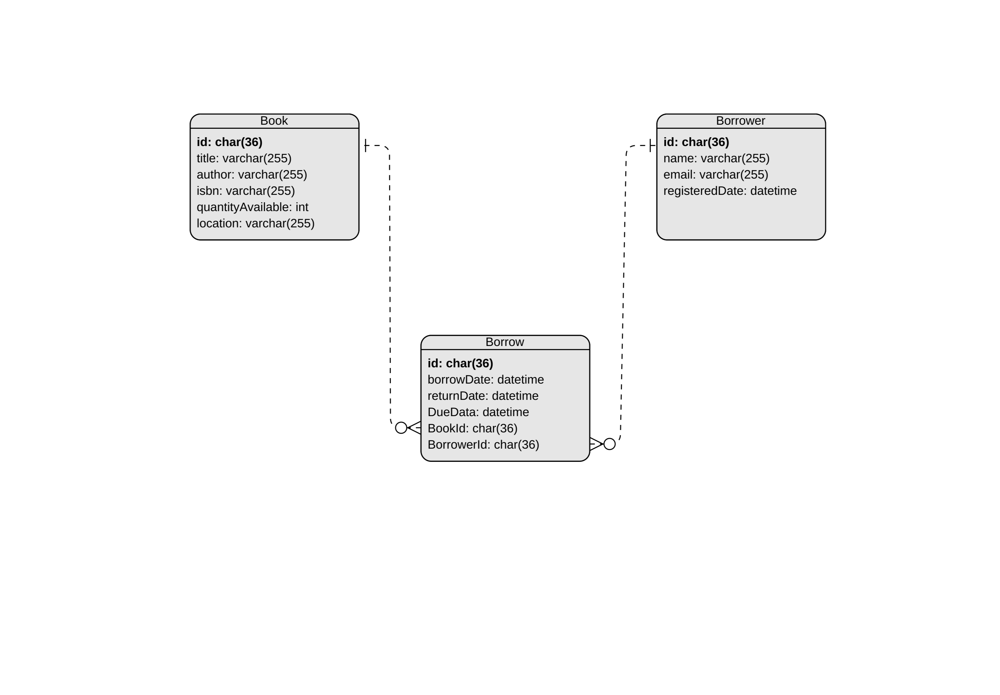

# Library Management System

The Library Management System is a Node.js-based application designed to streamline the management of books, borrowers, and borrowing processes in a library setting. With a robust set of features, the system allows users to add, update, and delete books, register borrowers, and facilitate the borrowing and returning of books. The application prioritizes performance, scalability, and security, utilizing a relational MySQL database and a RESTful API for seamless integration and optimal user experience. Additionally, the system offers analytical reporting capabilities, empowering users to generate insightful reports on the borrowing process within specific periods. Whether you're a librarian or a developer, this project provides a foundation for efficient library management and can easily adapt to future enhancements.

## Table of Contents

- [Features](#features)
- [Technologies Used](#technologies-used)
- [Getting Started](#getting-started)
  - [Prerequisites](#prerequisites)
  - [Installation](#installation)
  - [Running the Application](#running-the-application)
- [API Endpoints](#api-endpoints)
  - [Books](#books)
  - [Borrowers](#borrowers)
  - [Borrowing Process](#borrowing-process)
- [Schema Diagram](#schema-diagram)

## Features

- Add, update, delete, list, and search books.
- Register, update, delete, and list borrowers.
- Borrow and return books, track due dates, and manage overdue books.
- Performance-optimized for frequent reading operations.
- Scalable design to support future features.
- Security measures to prevent potential threats.
- RESTful API implementation.

## Technologies Used

- Node.js
- Express.js
- Sequelize (with MySQL database)
- Express Validator
- Express Rate Limi

## Getting Started

### Prerequisites

- Node.js installed on your machine
- MySQL database server
- npm (Node Package Manager)

### Installation

1. **Clone the repository:**

   ```bash
   git clone https://github.com/AhmedKhaleda998/Library-Management-System.git

2. **Navigate to the project directory:**

   ```bash
   cd library-management-system

3. **Install dependencies:**

   ```bash
   npm install

### Running the Application

1. **Set up the MySQL database:**

- Create a MySQL database.
- Update the database configuration in `configurations/database.js` with your database details.

2. **Start the application:**

   ```bash
   node app.js

## API Endpoints

### Books

- **Create a Book**

    - **Endpoint:** `POST /books`
    - **input:**
        ```bash
        {
            "title": "Sample Book",
            "author": "John Doe",
            "quantityAvailable": 10,
            "isbn": "1234567890",
            "location": "A1"
        }

    - **output:**
        ```bash
        {
            "message": "Book created",
            "book": {
                "id": "generated-uuid",
                "title": "Sample Book",
                "author": "John Doe",
                "quantityAvailable": 10,
                "isbn": "1234567890",
                "location": "A1"
            }
        }

- **List All Books**

    - **Endpoint:** `GET /books`
    - **output:**
        ```bash
        {
            "message": "Fetching all books",
            "books": [
                {
                "id": "book-1-uuid",
                "title": "Book 1",
                "author": "Author 1",
                "quantityAvailable": 5,
                "isbn": "1234567891",
                "location": "B2"
                },
                // ... other books ...
            ]
        }

- **Get a Book by ID**

    - **Endpoint:** `GET /books/:id`
    - **output:**
        ```bash
        {
            "message": "Fetching book by id",
            "book": {
                "id": "book-1-uuid",
                "title": "Book 1",
                "author": "Author 1",
                "quantityAvailable": 5,
                "isbn": "1234567891",
                "location": "B2"
            }
        }

- **Update a Book**

    - **Endpoint:** `PUT /books/:id`
    - **input:**
        ```bash
        {
            "title": "Updated Book Title",
            "author": "Updated Author",
            "quantityAvailable": 8,
            "location": "C3"
        }


    - **output:**
        ```bash
        {
            "message": "Book updated",
            "book": {
                "id": "book-1-uuid",
                "title": "Updated Book Title",
                "author": "Updated Author",
                "quantityAvailable": 8,
                "isbn": "1234567891",
                "location": "C3"
            }
        }


- **Delete a Book**

    - **Endpoint:** `DELETE /books/:id`
    - **input:**

    - **output:**
        ```bash
        {
            "message": "Book deleted",
            "book": {
                "id": "book-1-uuid",
                "title": "Updated Book Title",
                "author": "Updated
            }
        }

- **Search for Books**

    - **Endpoint:** `GET /books/search`

    - **Query Parameters:** `title`, `author`, `isbn`
    - **output:**
        ```bash
        {
            "message": "Searching books",
            "books": [
                {
                "id": "book-1-uuid",
                "title": "Book 1",
                "author": "Author 1",
                "quantityAvailable": 5,
                "isbn": "1234567891",
                "location": "B2"
                },
                // ... other books ...
            ]
        }

### Borrowers

- **Register a Borrower**

    - **Endpoint:** `POST /borrowers/register`
    - **input:**
        ```bash
        {
            "name": "John Doe",
            "email": "john@example.com"
        }

    - **output:**
        ```bash
        {
            "message": "Borrower created",
            "borrower": {
                "id": "generated-uuid",
                "name": "John Doe",
                "email": "john@example.com",
                "registeredDate": "2023-11-09T00:00:00.000Z"
            }
        }


- **List All Borrowersr**

    - **Endpoint:** `GET /borrowers`

    - **output:**
        ```bash
        {
            "message": "Fetching all borrowers",
            "borrowers": [
                {
                "id": "borrower-1-uuid",
                "name": "John Doe",
                "email": "john@example.com",
                "registeredDate": "2023-11-09T00:00:00.000Z"
                },
                // ... other borrowers ...
            ]
        }

- **Get a Borrower by ID**

    - **Endpoint:** `GET /borrowers/:id`

    - **output:**
        ```bash
        {
            "message": "Fetching Borrower",
            "borrower": {
                "id": "borrower-1-uuid",
                "name": "John Doe",
                "email": "john@example.com",
                "registeredDate": "2023-11-09T00:00:00.000Z"
            }
        }


- **Update a Borrower**

    - **Endpoint:** `PUT /borrowers/:id`
    - **input:**
        ```bash
        {
            "name": "Updated Name",
            "email": "updated.email@example.com"
        }


    - **output:**
        ```bash
        {
            "message": "Borrower updated",
            "borrower": {
                "id": "borrower-1-uuid",
                "name": "Updated Name",
                "email": "updated.email@example.com",
                "registeredDate": "2023-11-09T00:00:00.000Z"
            }
        }

- **Delete a Borrower**

    - **Endpoint:** `DELETE /borrowers/:id`

    - **output:**
        ```bash
        {
            "message": "Borrower deleted",
            "borrower": {
                "id": "borrower-1-uuid",
                "name": "Updated Name",
                "email": "updated.email@example.com",
                "registeredDate": "2023-11-09T00:00:00.000Z"
            }
        }


### Borrowing Process

- **Borrow a Book**

    - **Endpoint:** `POST /borrows/:borrowerId/:bookId`

    - **output:**
        ```bash
        {
            "message": "Book borrowed",
            "borrow": {
                "id": "generated-uuid",
                "borrowDate": "2023-11-09T00:00:00.000Z",
                "returnDate": null,
                "dueDate": "2023-11-23T00:00:00.000Z",
                "BookId": "book-1-uuid",
                "BorrowerId": "borrower-1-uuid"
            }
        }

- **Return a Book**

    - **Endpoint:** `POST /borrows/return/:borrowerId/:bookId`

    - **output:**
        ```bash
        {
            "message": "Book returned",
            "borrow": {
                "id": "generated-uuid",
                "borrowDate": "2023-11-09T00:00:00.000Z",
                "returnDate": "2023-11-16T00:00:00.000Z",
                "dueDate": "2023-11-23T00:00:00.000Z",
                "BookId": "book-1-uuid",
                "BorrowerId": "borrower-1-uuid"
            }
        }

- **Create a Report**

    - **Endpoint:** `POST /borrows/report`
    - **input:**
        ```bash
        {
            "startDate": "2023-11-5",
            "endDate": "2023-12-1"
        }

    - **output:**
        
        ` A CSV file contains the borrowing processes in this specific duration`


- **Get all Borrowing Processes**

    - **Endpoint:** `GET /borrows`

    - **output:**
        ```bash
        {
            "message": "Fetching all borrowed books",
            "borrows": [
                {
                    "id": "27b8ae2d-6570-4191-a751-9fdf86e35dc3",
                    "borrowDate": "2023-11-03T23:54:39.000Z",
                    "returnDate": null,
                    "dueDate": "2023-11-05T23:54:39.000Z",
                    "createdAt": "2023-11-09T23:54:39.000Z",
                    "updatedAt": "2023-11-09T23:54:39.000Z",
                    "BookId": "9eda78e4-ca96-4233-b9a0-91e63d4ae4ad",
                    "BorrowerId": "3053cc98-44a9-4dac-9e27-0ffbe58f4df9",
                    "Book": {
                        "title": "1984",
                        "author": "George Orwell",
                        "isbn": "978-0-452-28423-4"
                    }
                }
            ]
        }

- **Get Last Month Borrowing Processes**

    - **Endpoint:** `GET /borrows/lastMonth`
    
    - **output:**
        ```bash
        {
            "message": "Fetching all borrow processes last month",
            "borrows": [
                {
                    "id": "1f0f3afb-25c9-4b31-a66e-18ac37cc8ce9",
                    "borrowDate": "2023-11-09T19:45:43.000Z",
                    "returnDate": "2023-11-09T19:46:28.000Z",
                    "dueDate": "2023-11-23T19:45:43.000Z",
                    "createdAt": "2023-11-09T19:45:43.000Z",
                    "updatedAt": "2023-11-09T19:46:28.000Z",
                    "BookId": "0afd2501-5f07-4a70-a7be-dac5c6194f45",
                    "BorrowerId": "0505bdd1-93b1-4e0c-a272-0f56d37392ef",
                    "Book": {
                        "title": "To Kill a Mockingbird",
                        "author": "Harper Lee",
                        "isbn": "978-0-06-112008-4"
                    }
                },
                // ... other borrows ...
            ]
        }

- **Get all due Borrowed Books**

    - **Endpoint:** `GET /borrows/due`
    
    - **Query Parameters:** `borrowerId`
    - **output:**
        ```bash
        {
            "message": "All due books",
            "borrows": [
                {
                    "id": "27b8ae2d-6570-4191-a751-9fdf86e35dc3",
                    "borrowDate": "2023-11-03T23:54:39.000Z",
                    "returnDate": null,
                    "dueDate": "2023-11-05T23:54:39.000Z",
                    "createdAt": "2023-11-09T23:54:39.000Z",
                    "updatedAt": "2023-11-09T23:54:39.000Z",
                    "BookId": "9eda78e4-ca96-4233-b9a0-91e63d4ae4ad",
                    "BorrowerId": "3053cc98-44a9-4dac-9e27-0ffbe58f4df9",
                    "Book": {
                        "title": "1984",
                        "author": "George Orwell",
                        "isbn": "978-0-452-28423-4"
                    }
                },
                // ... other borrows ...
            ]
        }


- **Get due Borrowed Books from Last Month**

    - **Endpoint:** `GET /borrows/due/lastMonth`
    
    - **output:**
        ```bash
        {
            "message": "All due books last month",
            "borrows": [
                {
                    "id": "27b8ae2d-6570-4191-a751-9fdf86e35dc3",
                    "borrowDate": "2023-11-03T23:54:39.000Z",
                    "returnDate": null,
                    "dueDate": "2023-11-05T23:54:39.000Z",
                    "createdAt": "2023-11-09T23:54:39.000Z",
                    "updatedAt": "2023-11-09T23:54:39.000Z",
                    "BookId": "9eda78e4-ca96-4233-b9a0-91e63d4ae4ad",
                    "BorrowerId": "3053cc98-44a9-4dac-9e27-0ffbe58f4df9",
                    "Book": {
                        "title": "1984",
                        "author": "George Orwell",
                        "isbn": "978-0-452-28423-4"
                    }
                },
                // ... other borrows ...
            ]
        }

- **Get all Borrowed Books by specific Borrower**

    - **Endpoint:** `GET /borrows/:borrowerId`
    
    - **output:**
        ```bash
        {
            "message": "Fetching borrowed books",
            "borrows": [
                {
                    "id": "27b8ae2d-6570-4191-a751-9fdf86e35dc3",
                    "borrowDate": "2023-11-03T23:54:39.000Z",
                    "returnDate": null,
                    "dueDate": "2023-11-05T23:54:39.000Z",
                    "createdAt": "2023-11-09T23:54:39.000Z",
                    "updatedAt": "2023-11-09T23:54:39.000Z",
                    "BookId": "9eda78e4-ca96-4233-b9a0-91e63d4ae4ad",
                    "BorrowerId": "3053cc98-44a9-4dac-9e27-0ffbe58f4df9",
                    "Book": {
                        "title": "1984",
                        "author": "George Orwell",
                        "isbn": "978-0-452-28423-4"
                    }
                },
                // ... other borrows ...
            ]
        }


# Schema Diagram




## Conclusion

Thank you for exploring our Library Management System!

---